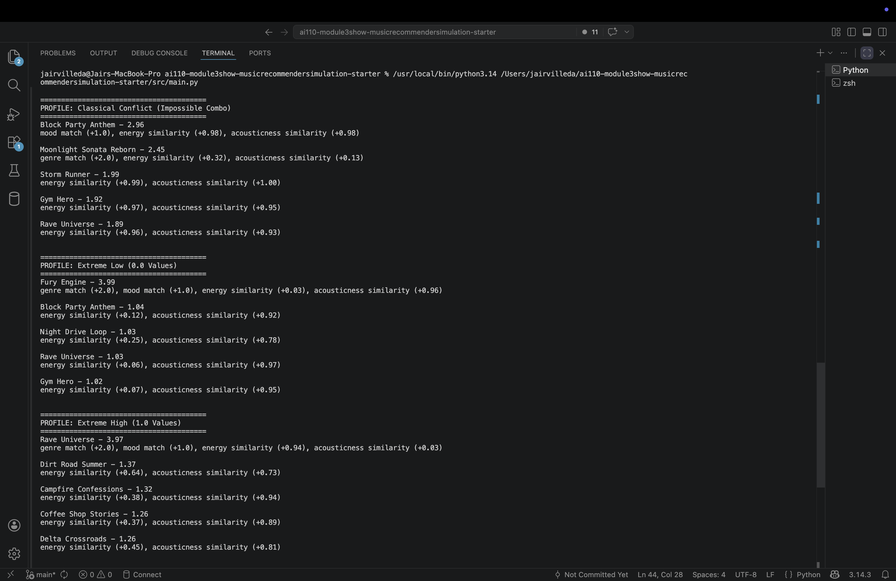
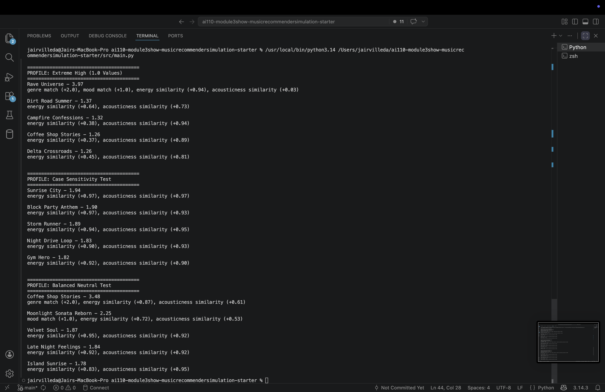
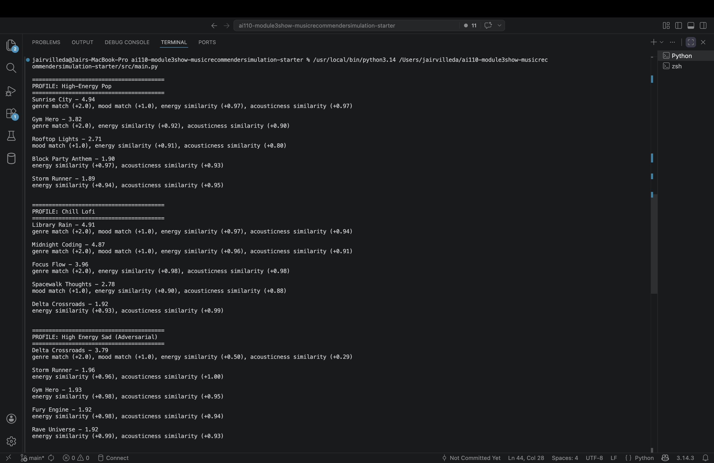

# 🎵 Music Recommender Simulation

## Project Summary

This project builds a simple content-based music recommender system. It represents songs using features like genre, mood, energy, and acousticness, and compares them to a user’s preferences. Each song is given a score based on how well it matches the user’s taste, and the top-ranked songs are recommended. The goal is to understand how basic scoring rules can simulate real-world recommendation systems and to analyze their strengths and limitations.

---

## How The System Works

Each song is represented using a few key features: genre, mood, energy, and acousticness.

The user profile stores preferences for:
- favorite genre
- favorite mood
- target energy level
- target acousticness

The recommender compares each song to the user’s preferences and assigns a score.

- If the genre matches, the song gets +2.0 points  
- If the mood matches, the song gets +1.0 point  
- Energy similarity is calculated as:  
  similarity = 1 − |song.energy − user.target_energy|  
- Acousticness similarity is calculated the same way  

The final score is the sum of all these values. After scoring every song, the system sorts them from highest to lowest score and returns the top 5 recommendations.

---
Real-world recommendations systems like Spotify and Youtube predict what users will like by analyzing patterns in user behavior and content features. They usually combine collaborative filtering (which learns from what similar users like) and content-based filtering (which recommends items similar to what a user has already interacted with). In large-scale systems, this data is continously updated using signals like skips, likes, and watch time. These systems also use detailed content attributes such as genre, tempo, and mood. At a high level, recommendation systems take input data (user behavior + song attributes), compare it against user preferences or learned user embeddings, and then produce a ranked list of items based on predicted revelance.

This simulation will prioritize content-based filtering. Each SONG is represented by a small set of features and each USER has a defined taste profile. The systems compares song features to user preferences and assigns a similiarity score to rank songs.
Song Features (Song Object):
- Genre (categorical)
- energy (float): representing intensity/vibe
- acousticness (float): representing how acoustic vs electronic the sound is
User Profile (UserProfile object):
- preferred_genre (string)
- preferred_energy (float)
- preferred_acousticness (float)

---
# Algorithm Recipe
Each song is scored using the following rules:
- +2.0 points if the genre matches the user’s favorite genre
- +1.0 point if the mood matches the user’s favorite mood
- Energy similarity = 1 − |song.energy − user.target_energy|
- Acousticness similarity = 1 − |song.acousticness − user.target_acousticness|
Final score:
- score = genre_score + mood_score + energy_similarity + acousticness_similarity
After scoring all songs, they are sorted from highest to lowest score, and the top 5 songs are recommended.

# Potential Biases
- Genre has the highest weight so songs outside the user’s preferred genre may be ranked lower even if they match well in other features
- Genre and mood together contribute more points than energy and acousticness, which can cause songs with weaker “vibe” matches to rank higher
- Genre and mood use exact matching, so similar categories like R&B vs soul are treated as completely different
- Energy and acousticness are weighted equally, even though different users may care more about one than the other
- Recommendations will often be dominated by songs that match the user’s preferred genre, leaving little room for out-of-genre songs. This means the system reinforces existing preferences but is less effective at helping users discover new music outside their comfort zone.

---


---




---
### Profile Comparisons

**High-Energy Pop vs Chill Lofi**  
The High-Energy Pop profile recommends upbeat, energetic songs like "Gym Hero" because the user wants high energy and low acousticness. In contrast, the Chill Lofi profile shifts toward slower, more relaxed songs like "Library Rain" that have lower energy and higher acousticness. This makes sense because the two profiles are looking for completely different vibes.

**High-Energy Pop vs High Energy Sad (Adversarial)**  
Both profiles prefer high-energy songs, but the High Energy Sad profile ranks "Delta Crossroads" first because it matches the genre and mood (blues + sad), even though its energy is much lower than requested. This shows that genre and mood can outweigh energy, which is why a less energetic song still ranks first.

**Chill Lofi vs Extreme Low (0.0 Values)**  
Both profiles prefer lower energy, but the Extreme Low profile strongly favors "Fury Engine" because it matches genre and mood, even though it has very high energy. This happens because the system gives a lot of points for genre and mood, even when the actual sound of the song doesn’t match the user’s preference.

**Extreme Low vs Extreme High**  
The Extreme Low profile (energy = 0.0) and Extreme High profile (energy = 1.0) produce very different results. Low energy preferences push toward calm songs, while high energy preferences bring up intense songs like "Rave Universe." However, both profiles still prioritize genre and mood heavily, which can lead to unexpected top results.

**High-Energy Pop vs Case Sensitivity Test**  
These profiles are meant to be the same, but the Case Sensitivity profile performs worse because "Pop" and "Happy" don’t match "pop" and "happy" in the dataset. As a result, songs like "Gym Hero" lose their genre and mood bonus and only score based on energy and acousticness, lowering their rank.

**Balanced Neutral vs High-Energy Pop**  
The Balanced Neutral profile (energy = 0.5, acousticness = 0.5) produces more mixed results, while High-Energy Pop consistently favors energetic pop songs. This shows that even “neutral” settings still act like a preference for mid-range songs rather than no preference at all.


---

## Getting Started

### Setup

1. Create a virtual environment (optional but recommended):

   ```bash
   python -m venv .venv
   source .venv/bin/activate      # Mac or Linux
   .venv\Scripts\activate         # Windows

2. Install dependencies

```bash
pip install -r requirements.txt
```

3. Run the app:

```bash
python -m src.main
```

### Running Tests

Run the starter tests with:

```bash
pytest
```

You can add more tests in `tests/test_recommender.py`.

---

## Experiments You Tried

- I reduced the weight of genre and mood to make energy and acousticness more important. This made recommendations more balanced and less dominated by genre.
- I tested edge cases like extreme values (0.0 and 1.0) and conflicting preferences (high energy + sad mood) to see how the system behaves.
- I tested case sensitivity (e.g., "Pop" vs "pop") and found that mismatches caused the system to ignore genre and mood completely.

---

## Limitations and Risks

- The system uses a very small dataset, so recommendations lack diversity.
- It relies on exact matching for genre and mood, which can cause incorrect results due to formatting differences.
- Genre and mood are weighted heavily, which can override better matches in energy or acousticness.
- It does not consider other important features like lyrics, artist similarity, or user listening history.

---

## Reflection

This project showed me how recommendation systems turn simple data into meaningful suggestions. Even with a basic scoring formula, the system was able to produce recommendations that felt accurate in many cases. However, I also learned how sensitive these systems are to small design choices. Changing weights or input formatting could completely change the results, which highlights how important tuning and data quality are.

One surprising insight was how easily bias can appear. The system often over-prioritized genre, creating a “filter bubble” where users kept seeing the same type of music. This made me realize that real-world recommendation systems must carefully balance accuracy with diversity. Overall, this project helped me understand that even simple algorithms can feel intelligent, but they require thoughtful design to avoid unintended behavior.

---

## 7. `model_card_template.md`

Combines reflection and model card framing from the Module 3 guidance. :contentReference[oaicite:2]{index=2}  

```markdown
# 🎧 Model Card - Music Recommender Simulation

## 1. Model Name

Give your recommender a name, for example:

> VibeFinder 1.0

---

## 2. Intended Use

- What is this system trying to do
- Who is it for

Example:

> This model suggests 3 to 5 songs from a small catalog based on a user's preferred genre, mood, and energy level. It is for classroom exploration only, not for real users.

---

## 3. How It Works (Short Explanation)

Describe your scoring logic in plain language.

- What features of each song does it consider
- What information about the user does it use
- How does it turn those into a number

Try to avoid code in this section, treat it like an explanation to a non programmer.

---

## 4. Data

Describe your dataset.

- How many songs are in `data/songs.csv`
- Did you add or remove any songs
- What kinds of genres or moods are represented
- Whose taste does this data mostly reflect

---

## 5. Strengths

Where does your recommender work well

You can think about:
- Situations where the top results "felt right"
- Particular user profiles it served well
- Simplicity or transparency benefits

---

## 6. Limitations and Bias

Where does your recommender struggle

Some prompts:
- Does it ignore some genres or moods
- Does it treat all users as if they have the same taste shape
- Is it biased toward high energy or one genre by default
- How could this be unfair if used in a real product

---

## 7. Evaluation

How did you check your system

Examples:
- You tried multiple user profiles and wrote down whether the results matched your expectations
- You compared your simulation to what a real app like Spotify or YouTube tends to recommend
- You wrote tests for your scoring logic

You do not need a numeric metric, but if you used one, explain what it measures.

---

## 8. Future Work

If you had more time, how would you improve this recommender

Examples:

- Add support for multiple users and "group vibe" recommendations
- Balance diversity of songs instead of always picking the closest match
- Use more features, like tempo ranges or lyric themes

---

## 9. Personal Reflection

A few sentences about what you learned:

- What surprised you about how your system behaved
- How did building this change how you think about real music recommenders
- Where do you think human judgment still matters, even if the model seems "smart"

